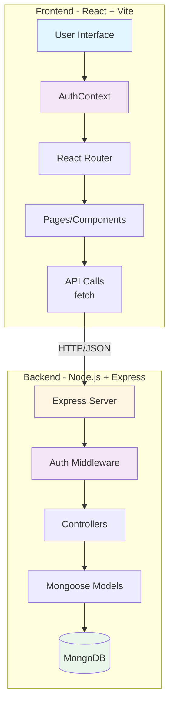
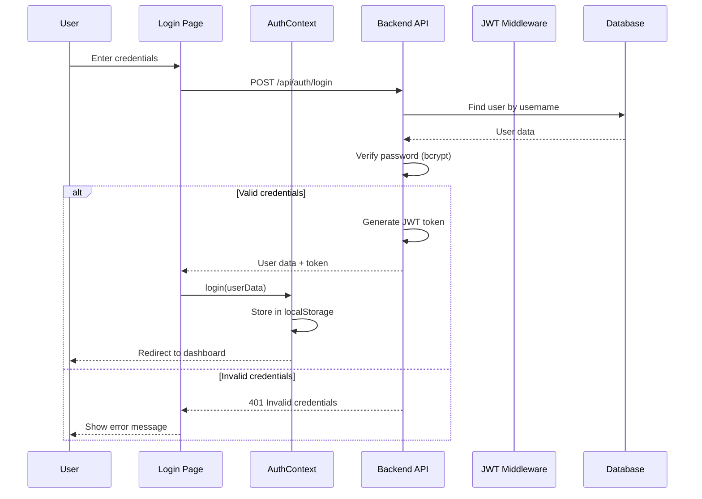
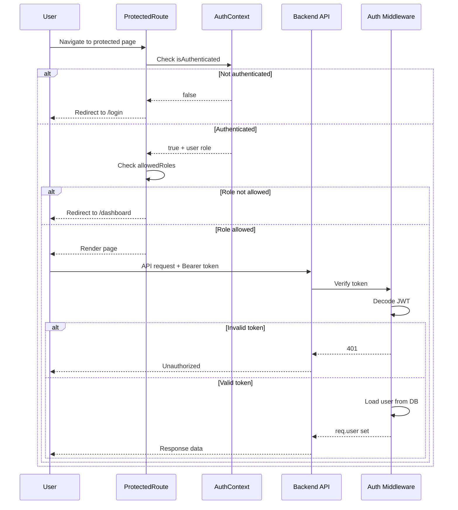
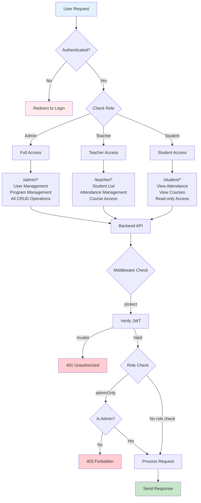
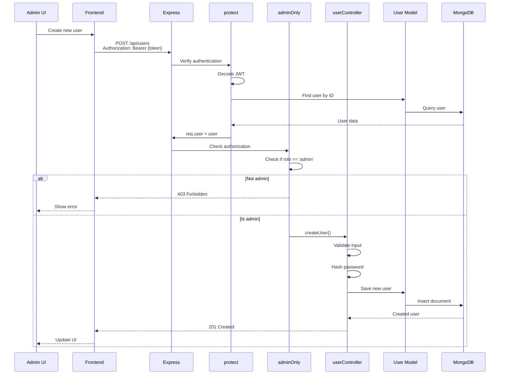
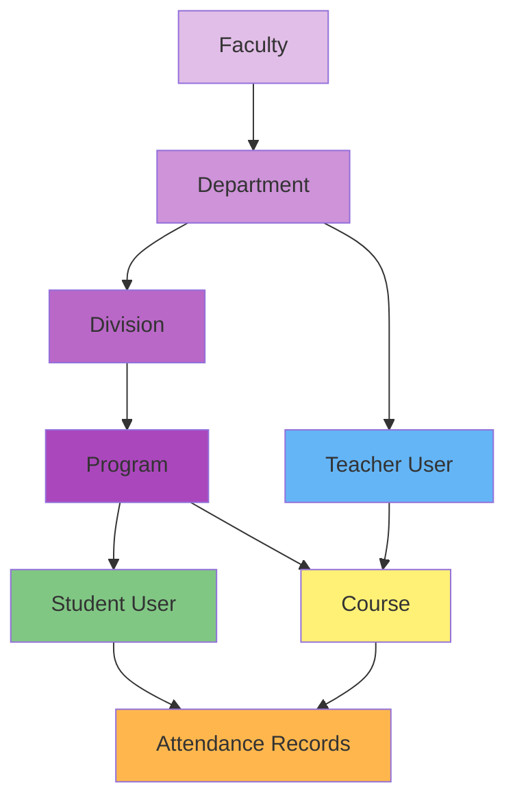
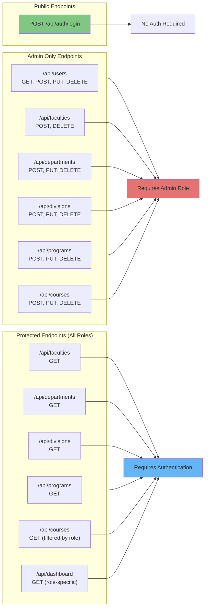
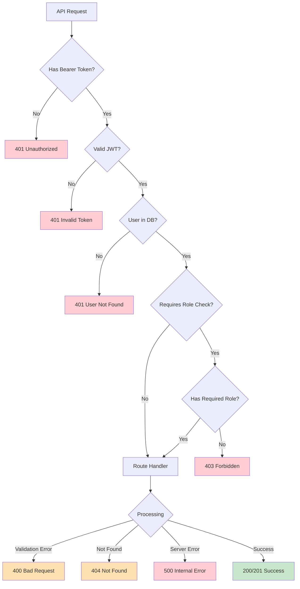

# Architecture Diagrams

> **Note**: This document contains Mermaid diagrams showing the system architecture and logic flow.
> Last updated: ${new Date().toISOString()}

## System Architecture



## Authentication Flow



## Protected Route Flow



## Role-Based Access Control (RBAC)



## Data Flow: User Management



## Data Hierarchy



## API Endpoint Coverage



## Frontend-Backend Integration

```mermaid
graph TB
    subgraph "Frontend Routes"
        LoginRoute["/login"]
        DashRoute["/dashboard"]
        AdminUsers["/admin/users"]
        AdminProgs["/admin/programs"]
        TeacherStud["/teacher/students"]
        TeacherAtt["/teacher/attendance"]
        StudentAtt["/student/attendance"]
    end

    subgraph "Frontend Components"
        UsersPage[UsersPage.jsx]
        ProgsPage[ProgramsPage.jsx]
        StudPage[StudentsPage.jsx]
        TeachAttPage[AttendancePage.jsx]
        StudAttPage[MyAttendancePage.jsx]
    end

    subgraph "API Endpoints"
        AuthAPI[POST /api/auth/login]
        UsersAPI[/api/users<br/>GET, POST, PUT, DELETE]
        ProgsAPI[/api/programs<br/>GET, POST, PUT, DELETE]
        CoursesAPI[/api/courses<br/>GET, POST, PUT, DELETE]
        DashAPI[GET /api/dashboard]
    end

    LoginRoute --> AuthAPI
    DashRoute --> DashAPI
    
    AdminUsers --> UsersPage
    UsersPage -->|fetch| UsersAPI
    
    AdminProgs --> ProgsPage
    ProgsPage -->|fetch| ProgsAPI
    
    TeacherStud --> StudPage
    StudPage -->|fetch| UsersAPI
    StudPage -->|fetch| ProgsAPI
    
    TeacherAtt --> TeachAttPage
    TeachAttPage -->|fetch| CoursesAPI
    
    StudentAtt --> StudAttPage
    StudAttPage -->|fetch| CoursesAPI

    style LoginRoute fill:#81c784
    style AdminUsers fill:#e57373
    style AdminProgs fill:#e57373
    style TeacherStud fill:#64b5f6
    style TeacherAtt fill:#64b5f6
    style StudentAtt fill:#ba68c8
```

## Error Handling Flow


