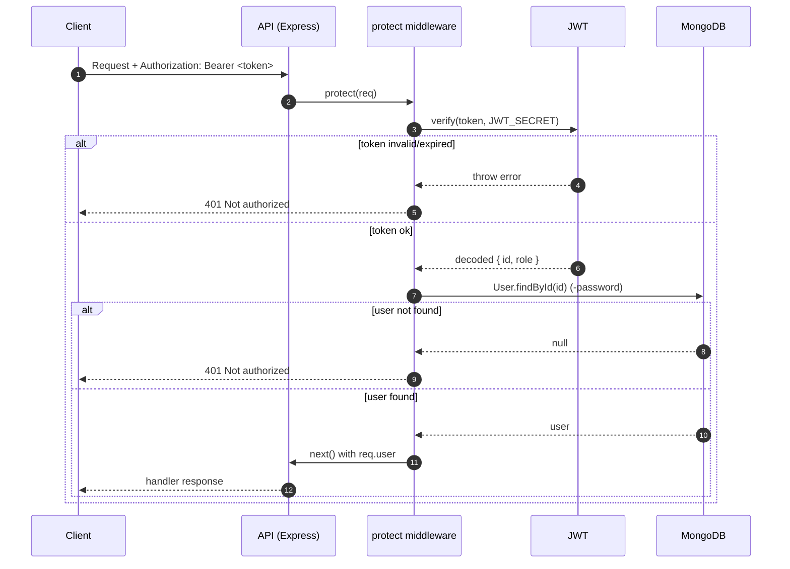

# Authentication & RBAC (Backend)

This document describes the current authentication and authorization (RBAC) logic implemented in `backend/`.

## Overview

- The system uses **JWT bearer tokens** for API authentication.
- Users authenticate with **`username` + `password`**.
- Role-based access control is enforced using middleware:
  - `protect`: validates JWT and loads `req.user`.
  - `adminOnly`: allows access only for users with role `admin`.

## Environment Variables

Required at runtime:

- `MONGO_URI`: MongoDB connection string.
- `JWT_SECRET`: secret used to sign and verify JWTs.

`backend/server.js` exits early if either is missing.

## Login (`POST /api/auth/login`)

### Request

```json
{
  "username": "admin",
  "password": "yourPassword"
}
```

### Response (success)

```json
{
  "_id": "...",
  "name": "...",
  "username": "admin",
  "role": "admin",
  "token": "<jwt>"
}
```

### JWT payload

The token is signed with payload:

```json
{ "id": "<userId>", "role": "admin|teacher|student" }
```

Token expiry: `30d`.

## Request Authentication (`protect` middleware)

`protect` expects an HTTP header:

```
Authorization: Bearer <token>
```

On success:

- Verifies the token using `JWT_SECRET`.
- Loads the user via `User.findById(decoded.id).select('-password')`.
- Attaches the user to `req.user`.

On failure:

- Returns `401`.

### Sequence Diagram



## Authorization (`adminOnly` middleware)

`adminOnly` assumes `protect` already ran and set `req.user`.

- If `req.user.role === 'admin'` → continue.
- Otherwise → return `403`.

### Role Gate Diagram

```mermaid
flowchart TD
    R[Incoming request] --> P[protect]
    P -->|401 if no/invalid token| X401[401 Not authorized]
    P -->|req.user set| G{adminOnly required?}
    G -->|No| H[Route handler]
    G -->|Yes| A{req.user.role == "admin"?}
    A -->|No| X403[403 Not authorized as an admin]
    A -->|Yes| H
```

## Current Protected Routes

### Faculties

Mounted under `backend/server.js`:

- Base path: `/api/faculties`

Routes:

- `GET /api/faculties` → `protect` → list faculties
- `POST /api/faculties` → `protect` → `adminOnly` → create faculty
- `DELETE /api/faculties/:id` → `protect` → `adminOnly` → delete faculty

### Courses

Mounted under `backend/server.js`:

- Base path: `/api/courses`

Routes:

- `GET /api/courses` → `protect` → list courses
  - Teachers are restricted to courses where `teacher == req.user._id`.
  - Students are restricted to courses where `program == req.user.program`.
- `GET /api/courses/:id` → `protect` → get one course (same role restrictions as above)
- `POST /api/courses` → `protect` → `adminOnly` → create course
- `PUT /api/courses/:id` → `protect` → `adminOnly` → update course
- `DELETE /api/courses/:id` → `protect` → `adminOnly` → delete course

### HTTP status conventions (current)

- `200`: successful reads/deletes
- `201`: successful creation
- `400`: validation errors (e.g. missing name)
- `401`: authentication failure
- `403`: authorization failure (role)
- `404`: resource not found
- `500`: server error

## Notes / Future Enhancements

- Add more role gates (e.g. `teacherOnly`, `studentOnly`) if needed.
- Consider centralizing error handling with an Express error middleware.
- Consider token refresh/shorter expiry if required.
