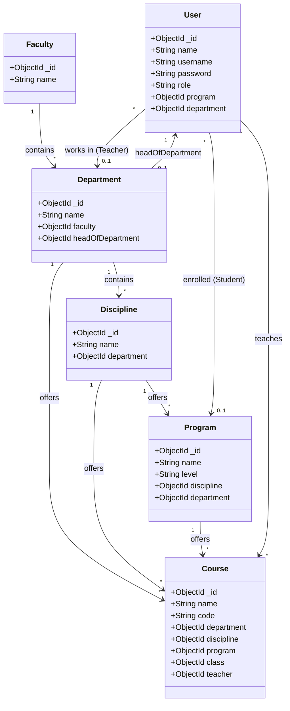
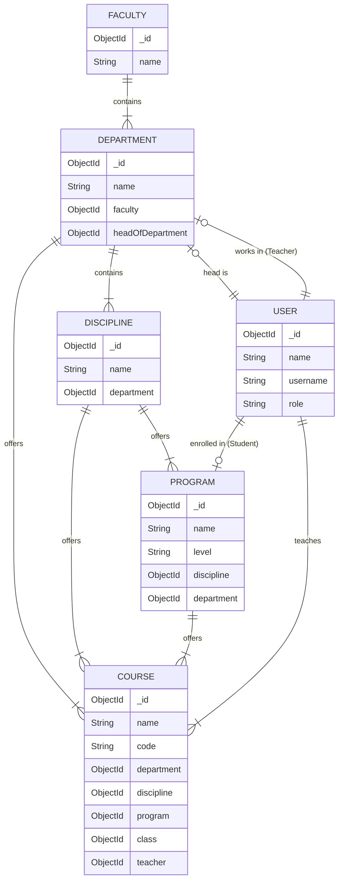

# Data Models & Hierarchy

This document illustrates the data hierarchy and relationships within the Attendance Management System.

## Hierarchy Overview

The academic structure is organized as follows:
1.  **Faculty**: The highest organizational unit (e.g., Faculty of Computing).
2.  **Department**: Belong to a Faculty (e.g., Department of CS).
3.  **Discipline**: Specialized academic units within a Department (e.g., Software Engineering).
4.  **Program**: Academic degrees offered by a Discipline (e.g., BS Software Engineering).

5.  **Users**:
    *   **Students** are enrolled in a **Program**.
    *   **Teachers** belong to a **Department**.
    *   **Admins** oversee the system.

## Course

`Course` represents a section-specific course offering: the same course code/name can exist multiple times across different class sections and/or teachers.

Fields:

- `name` (required)
- `code` (optional)
- `department` (required, ref `Department`)
- `discipline` (required, ref `Discipline`)
- `program` (required, ref `Program`)
- `class` (required, ref `Class`) — batch the course is offered to
- `teacher` (required, ref `User`)

Uniqueness:

- If `code` is set, the backend enforces uniqueness per offering as `(class, code, teacher)`.

Consistency rules enforced on create/update (backend):

- `discipline.department` must match the selected `department`.
- `program.discipline` must match the selected `discipline`.
- `teacher.role` must be `teacher`.
- If the selected teacher has `department` set, it must match the selected `department`.

## Entity Relationship Diagrams

### Class Diagram

### ER Diagram

