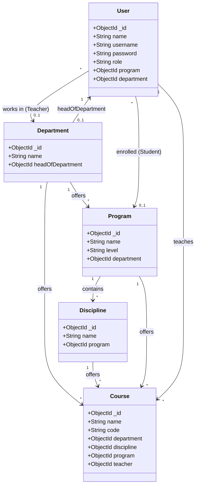
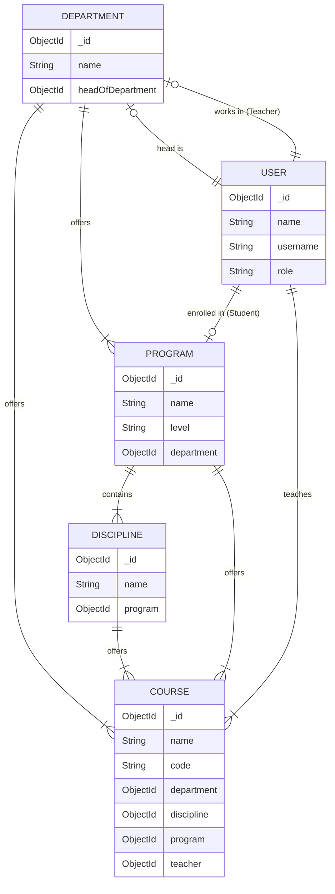

# Data Models & Hierarchy

This document illustrates the data hierarchy and relationships within the Attendance Management System.

## Hierarchy Overview

The academic structure is organized as follows:
1.  **Department**: An academic department (e.g., Department of Computer Science).
2.  **Program**: A degree program offered by a Department (e.g., BS, MS/MPhil/MBA, PhD, Diploma).
3.  **Discipline**: A specialization/track under a Program (e.g., Data Science, Artificial Intelligence).

5.  **Users**:
    *   **Students** are enrolled in a **Program**.
    *   **Teachers** belong to a **Department**.
    *   **Admins** oversee the system.

## Course

`Course` links an academic offering to the hierarchy and assigns a teacher.

Fields:

- `name` (required)
- `code` (optional)
- `department` (required, ref `Department`)
- `discipline` (required, ref `Discipline`)
- `program` (required, ref `Program`)
- `teacher` (required, ref `User`)

Consistency rules enforced on create/update (backend):

- `program.department` must match the selected `department`.
- `discipline.program` must match the selected `program`.
- `teacher.role` must be `teacher`.
- If the selected teacher has `department` set, it must match the selected `department`.

## Entity Relationship Diagrams

### Class Diagram

### ER Diagram

