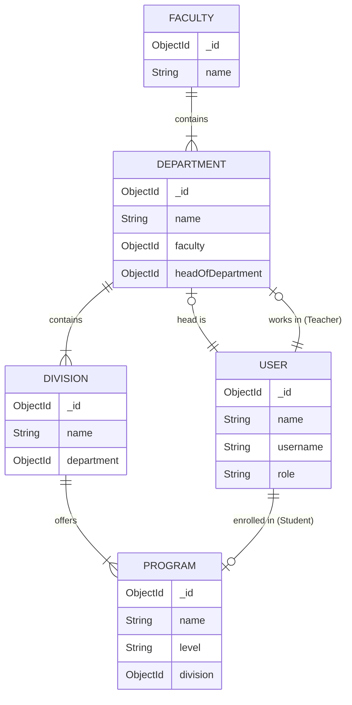

# Data Models & Hierarchy

This document illustrates the data hierarchy and relationships within the Attendance Management System.

## Hierarchy Overview

The academic structure is organized as follows:
1.  **Faculty**: The highest organizational unit (e.g., Faculty of Computing).
2.  **Department**: Belong to a Faculty (e.g., Department of CS).
3.  **Division**: Specialized units within a Department (e.g., AI Division).
4.  **Program**: Academic degrees offered by a Division (e.g., BS AI).

5.  **Users**:
    *   **Students** are enrolled in a **Program**.
    *   **Teachers** belong to a **Department**.
    *   **Admins** oversee the system.

## Entity Relationship Diagrams

### Class Diagram

### ER Diagram

